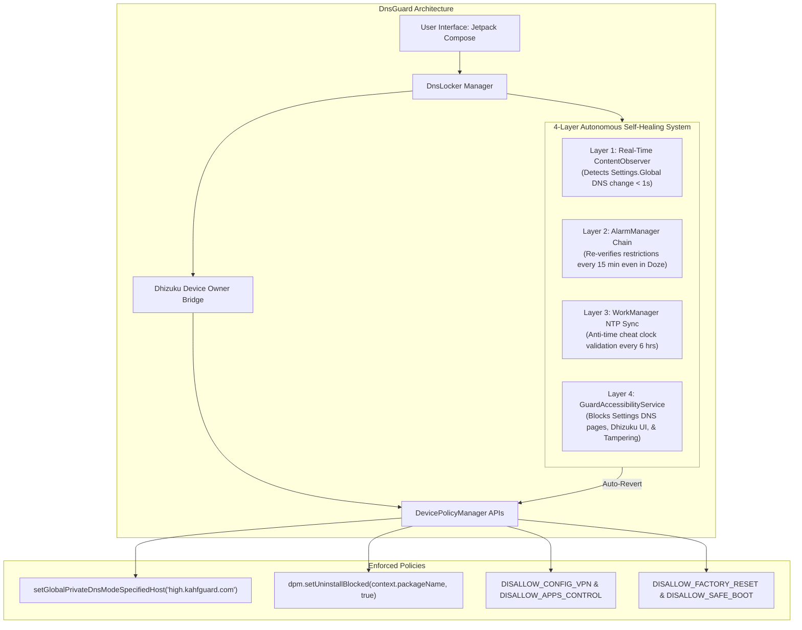

# 🛡️ DnsGuard — Cross-Platform Habit Protection & DNS Lockdown Suite

[](https://developer.android.com/)
[](https://microsoft.com)
[](https://kotlinlang.org/)
[](https://developer.android.com/jetpack/compose)
[](https://github.com/iamr0s/Dhizuku)
[](LICENSE)

> **DnsGuard** is a tamper-resistant, multi-layered digital habit protection and DNS enforcement system designed to eliminate digital relapse by locking device DNS (e.g., family-safe / clean DNS providers such as `high.kahfguard.com`) across both **Android** and **Windows PC** environments.

---

## 📑 Table of Contents
- [Key Highlights](#-key-highlights)
- [Architecture & Multi-Layer Defense](#-architecture--multi-layer-defense)
- [Android System Overview](#-android-system-overview)
  - [Zero-Leak Tamper Resistance](#zero-leak-tamper-resistance)
  - [Emergency Recovery Gate](#emergency-recovery-gate)
  - [Mindfulness & Progression Features](#mindfulness--progression-features)
- [PC Protection Suite (Windows)](#-pc-protection-suite-windows)
- [Installation & Setup](#-installation--setup)
  - [Android Setup](#1-android-setup)
  - [PC Setup](#2-pc-setup)
- [Secret Dialer Codes](#-secret-dialer-codes)
- [Technology Stack](#-technology-stack)
- [Contributing & Security](#-contributing--security)
- [License](#-license)

---

## ✨ Key Highlights

- **🔒 Unbypassable DNS Lockdown**: Locks system Private DNS via Android `DevicePolicyManager` (Device Owner mode) and Windows PowerShell adapter policies.
- **⚡ Quad-Layer Self-Healing Watchdogs**: Combines a real-time `ContentObserver`, Doze-resistant `AlarmManager`, periodic `WorkManager` NTP sync, and a hardened `AccessibilityService`.
- **🚀 High Performance & Battery Friendly**: Optimized accessibility event handling (`typeWindowStateChanged` only) with zero IPC overhead on unrelated applications.
- **📱 Granular App Management**: Selectively locks uninstallation for DnsGuard and Dhizuku without restricting other third-party apps or everyday utilities.
- **🧘 Built-in Grounding Tools**: Includes 4-4-4-4 Box Breathing guides, daily inspirational wisdom vaults, morning focus directives, and milestone badges.
- **💻 Desktop Coverage**: One-click scripts for Windows that configure adapters, restrict IP settings, prevent DNS leaks, and lock DNS over HTTPS (DoH).

---

## 🏛 Architecture & Multi-Layer Defense

DnsGuard employs a defense-in-depth model where no single component failure can compromise the protection state.



---

## 📱 Android System Overview

### Zero-Leak Tamper Resistance
1. **Device Owner Policies via Dhizuku**:
   - Automatically provisions DNS without root access.
   - Enforces `DISALLOW_CONFIG_PRIVATE_DNS` to block DNS alterations in system Settings.
   - Disables Factory Reset, Safe Boot, and VPN manipulation to eliminate common bypass vectors.
   - Restricts application storage controls (`DISALLOW_APPS_CONTROL`) to block clearing app data/cache.
2. **Selective Package Lockdown**:
   - Calls `dpm.setUninstallBlocked()` exclusively for DnsGuard and Dhizuku.
   - Clears blanket `DISALLOW_UNINSTALL_APPS` restrictions, allowing you to freely install and uninstall normal applications, games, and tools.
3. **Hardened Accessibility Guard**:
   - Intercepts and bounces attempts to access Private DNS dialogs, Dhizuku deactivation, and Accessibility toggle switches back to the Home screen.
   - Recycles all node references safely using `AccessibilityNodeInfo` pools to eliminate system memory leaks and prevent OS service disconnects.
4. **Anti-Time Cheat NTP Validation**:
   - Uses `NtpClient` to query true UTC time from network time servers (with HTTP Date header fallback).
   - Enforces an encrypted high-water mark so setting system clocks forward cannot spoof lock expiration.

### Emergency Recovery Gate
If an urgent situation arises, DnsGuard provides a controlled, intentional, and sober recovery gate:
- Accessible exclusively through secret code `*#*#7777#*#*`.
- Enforces an mandatory cool-off countdown (e.g., 10 minutes) before actions can be taken.
- Requires dual math verification challenges and typing a sober reflection pledge.
- Operates only within safe daytime hours to deter impulsive late-night relapses.

### Mindfulness & Progression Features
- **Box Breathing Guide**: Interactive 4-4-4-4 animated guide (Inhale 4s, Hold 4s, Exhale 4s, Hold 4s) to ground impulse urges.
- **Daily Wisdom Vault**: Curated reflections, real recovery milestones, and habit psychology insights.
- **Home Widget**: A sleek homescreen countdown widget providing continuous visibility of remaining days.
- **Scheduled Directives**: Morning focus affirmations at 8:00 AM and nightly reflections at 9:30 PM.

---

## 💻 PC Protection Suite (Windows)

Included in the root directory are PowerShell scripts designed to lock down Windows 10/11 machines:

| File | Purpose | Key Actions |
| :--- | :--- | :--- |
| `PROTECT_MY_PC.bat` | One-Click Launcher | Automatically requests Administrator privileges and runs `setup_pc_protection.ps1`. |
| `setup_pc_protection.ps1` | Windows Lockdown | - Sets primary/secondary IPv4 and IPv6 DNS on all active network adapters.<br>- Disables LLMNR and NetBIOS DNS leak vulnerabilities.<br>- Locks Windows Registry DNS keys against non-admin editing.<br>- Flushes DNS cache to apply changes immediately. |
| `remove_pc_protection.ps1` | Recovery Script | Restores automated DHCP / dynamic DNS assignment on all adapters with admin approval. |

---

## 🚀 Installation & Setup

### 1. Android Setup

#### Prerequisites:
- Android 10 (API level 29) or higher.
- [Dhizuku](https://github.com/iamr0s/Dhizuku) installed on the device and activated as Device Owner via ADB:
  ```bash
  adb shell dpm set-device-owner com.rosan.dhizuku/.server.DhizukuDAReceiver
  ```

#### Installing DnsGuard:
1. Clone this repository:
   ```bash
   git clone https://github.com/zenbijoy/DnsGuard.git
   cd DnsGuard
   ```
2. Build the project using Gradle:
   ```bash
   ./gradlew assembleDebug
   ```
3. Install the APK to your device via USB:
   ```bash
   adb install -r -d DnsGuard/app/build/outputs/apk/debug/app-debug.apk
   ```
4. Open **DnsGuard** on your device:
   - Grant **Dhizuku Permission**.
   - Enable **Accessibility Guard** (labeled *System Service* in Accessibility Settings).
   - Tap **Fix** on Battery Optimization to grant *Unrestricted* background operation.
   - Tap **LOCK FOR 1 YEAR** to activate total protection.

---

### 2. PC Setup

1. Open the repository root folder on your Windows PC.
2. Right-click `PROTECT_MY_PC.bat` and select **Run as Administrator** (or double-click to accept the UAC prompt).
3. The script will automatically discover all active Wi-Fi and Ethernet adapters, set the safe DNS endpoints, flush the local DNS cache, and confirm protection status.

---

## 🔢 Secret Dialer Codes

For stealth and tamper prevention, DnsGuard's UI activities are hidden from the application launcher and recents screen by default. Use your phone's stock dialer keypad to open:

| Secret Code | Destination | Description |
| :--- | :--- | :--- |
| `*#*#1234#*#*` | **DnsGuard Main Dashboard** | View live DNS resolution telemetry, streak progress, milestone badges, and mindfulness exercises. |
| `*#*#7777#*#*` | **Emergency Recovery Gate** | Enter cool-off verification, math challenges, and intentional recovery overrides. |

*(Note: On devices with non-standard dialers, you can trigger open intents via ADB:*
```bash
adb shell am start -n com.dnsguard.locker/.MainActivity
```
*)*

---

## 🛠 Technology Stack

- **Android Platform**:
  - **Language**: Kotlin 1.9
  - **UI Framework**: Jetpack Compose & Material 3
  - **Asynchronous**: Kotlin Coroutines (`Dispatchers.IO`, `SupervisorJob`)
  - **Background Work**: Android Foreground Service, `AlarmManager`, `WorkManager`
  - **Security**: `EncryptedSharedPreferences` (Jetpack Security Crypto), `DevicePolicyManager`
  - **Privilege Layer**: [Dhizuku-API 2.5.3](https://github.com/iamr0s/Dhizuku) + `HiddenApiBypass`
- **Windows PC Platform**:
  - Windows PowerShell 5.1+
  - Windows Batch script with automated UAC elevation

---

## 🔒 Contributing & Security

Contributions, bug reports, and suggestions are welcome!
- If you discover a bypass vector or unexpected behavior, please file an issue or pull request detailing the device manufacturer, Android version, and reproduction steps.
- Security-sensitive findings can be reported directly via GitHub issues.

---

## 📄 License

This project is licensed under the MIT License — see the [LICENSE](LICENSE) file for details.