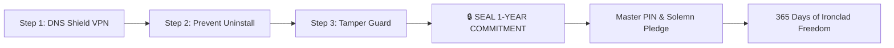
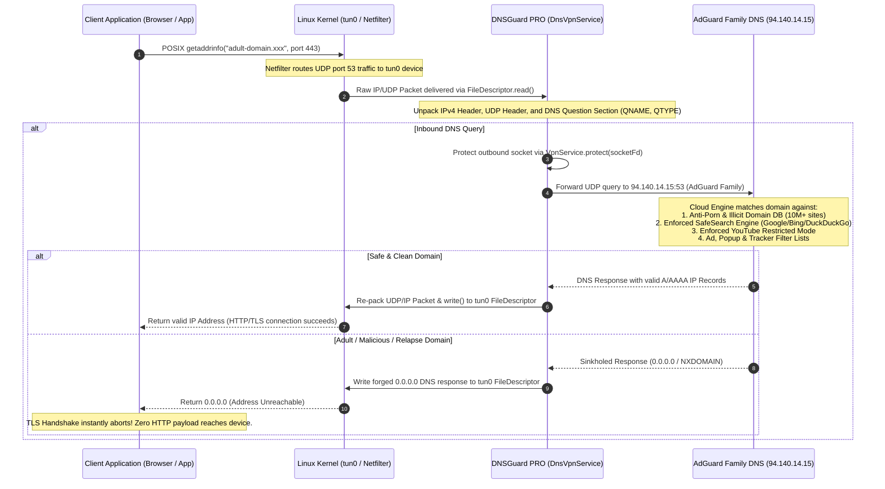
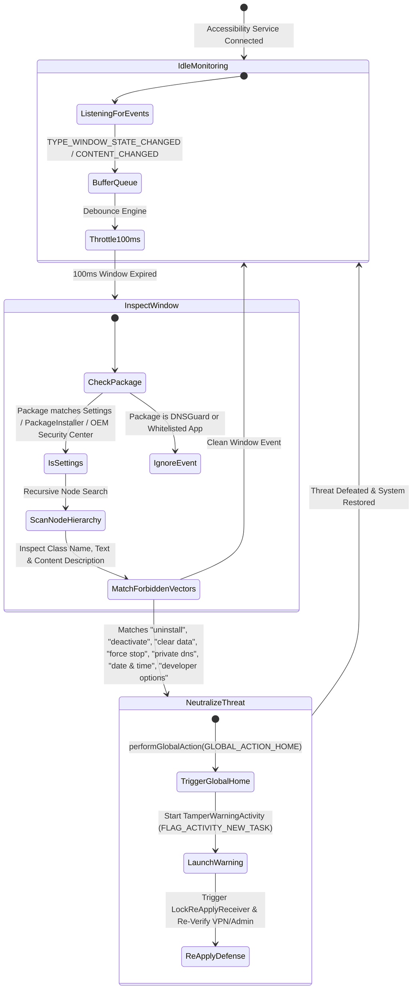
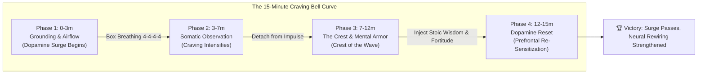

# 🛡️ DNSGuard PRO — The Uncompromising 1-Year Addiction Remover

<p align="center">
  
  
  
  
  
  
</p>

---

## ⚡ The Solemn Warning: Read Before Installing

> ### ⚠️ **TARGET: 365 DAYS OF UNCOMPROMISING FREEDOM**
> **DNSGuard PRO** is not a superficial blocker with a quick toggle switch or bypass button. It is engineered for individuals who are **100% serious** about breaking free from adult content, compulsive relapse triggers, and porn addiction permanently.
> 
> **IF YOU ARE NOT 100% SERIOUS, DO NOT DOWNLOAD OR ACTIVATE THIS APP.**
> 
> Once sealed with your Master Security PIN and solemn pledge:
> * ⛔ **NO WAY** to bypass, disable, pause, or toggle off protection for **365 days (1 full year)**.
> * ⛔ **ALL** adult, pornographic, and relapse domains are blocked at the kernel network level (`0.0.0.0` sinkhole).
> * ⛔ **100% AD-FREE:** Blocks video ads, tracking telemetry, invasive popups, and malicious redirect engines.
> * ⛔ Android Device Administrator + Accessibility Guard block settings tampering, clearing data, force-stopping, and uninstall attempts.
> * ⛔ Triple-redundant hardware-backed cryptographic timer locks prevent device date/time spoofing.
> * ⛔ There is no emergency unlock code, no secret backdoor, and no soft exit until the countdown reaches zero.

---

## 🌟 Why DNSGuard PRO?

Most addiction blocker apps fail because willpower fluctuates. When an acute dopamine craving strikes, the brain seeks the path of least resistance. Within 10 seconds, a user opens Settings, toggles the VPN off, uninstalls the blocker, and relapses.

**DNSGuard PRO eliminates the relapse vector entirely.** By combining:
1. An on-device loopback DNS VPN forcing **AdGuard Family Protection**;
2. Android Device Administration blocking application uninstallation;
3. Real-time Accessibility Service watchdog closing tampering attempts in <100ms;
4. High-water mark monotonic cryptographic timers immune to device clock rollbacks; and
5. An emergency **15-Minute Urge Surfing Protocol** backed by neuroscience and Stoic mental armor.

### 📱 100% Standalone — Zero PC / Zero ADB Required
* **No computer or USB debugging needed:** Previous solutions required connecting your phone to a computer with command-line tools. **DNSGuard PRO is 100% standalone** and activates in under 60 seconds directly on your mobile device.
* **Play Store Compliant:** Meticulously engineered within official Android guidelines (VpnService prominent disclosure, minimal Device Administrator footprint without invasive data-wipe policies, and strict zero-telemetry privacy).
* **Dual Architecture:** Operates seamlessly in standalone user mode on 100% of Android devices, while offering optional Device Owner privileged integration if available.

---

## 🚀 The 3-Step 60-Second Setup Wizard



1. **Step 1: Enable DNS Shield**
   * Establishes a local on-device VPN loopback that routes all outbound DNS queries to **AdGuard Family Protection** (`family.adguard-dns.com`, `94.140.14.15`, `94.140.15.16`).
   * **100% Adult Content Blocked:** Strict anti-porn filters + enforced SafeSearch across Google, Bing, DuckDuckGo & YouTube Restricted Mode.
   * **100% Ad & Tracker Free:** Blocks video ads, invasive popups, malicious redirect networks, and tracking telemetry.
2. **Step 2: Prevent App Uninstall (Device Administrator)**
   * Registers DNSGuard PRO as an active Android Device Administrator.
   * Standard Android security policy prevents uninstalling the app from the launcher or app drawer.
3. **Step 3: Tamper Protection (Accessibility Guard)**
   * Activates the real-time window guard with Google Play prominent disclosure.
   * Instantly closes attempts to deactivate Device Administrator, clear storage, or change DNS settings.
4. **Final Action: Seal 1-Year Commitment**
   * Pulsing golden button unlocks once all 3 steps are active.
   * Create your 4–6 digit Master Security PIN, confirm your solemn pledge, and lock the device for 365 days.

---

## 🏛️ Comprehensive Android OS System Architecture

DNSGuard PRO is engineered from the ground up to operate across every boundary of the Android OS stack — from the Linux Kernel network drivers up through the System Server daemons to the Jetpack Compose user space.

### 1. Multi-Tier Android OS System Topology

```mermaid
graph TB
    subgraph UserSpace ["User Space (Applications)"]
        Browser["Web Browsers (Chrome, Firefox, Brave)"]
        SocialApps["Social & Media Apps (TikTok, IG, X, Reddit)"]
        SettingsApp["Android OS Settings (com.android.settings)"]
        DNSGuardApp["🛡️ DNSGuard PRO Application Process"]
    end

    subgraph AppInternal ["DNSGuard PRO Security Engine"]
        UI["Jetpack Compose UI (MainActivity, UrgeSurfingDialog)"]
        VPNService["DnsVpnService (TUN Loopback Packet Interceptor)"]
        AccessService["GuardAccessibilityService (Anti-Tamper Watchdog)"]
        DevAdmin["DeviceAdminManager (Device Policy Receiver)"]
        Watchdog["LockMonitorService (ContentObserver Watchdog)"]
        NTPDaemon["NtpSyncWorker (Atomic Clock Sync via WorkManager)"]
        TimerEngine["TimerManager & EncryptedSharedPreferences"]
    end

    subgraph Framework ["Android Framework & System Server"]
        VpnMgr["VpnManagerService / ConnectivityService"]
        DPMS["DevicePolicyManagerService (DPMS)"]
        AMS["AccessibilityManagerService (AMS)"]
        WMS["WindowManagerService (WMS)"]
        AlarmMgr["AlarmManagerService"]
        JobMgr["JobSchedulerService"]
    end

    subgraph NativeDaemons ["Android Native Daemons & HAL"]
        netd["netd (Network Configuration Daemon via Netlink)"]
        keystore2["keystore2 (Android Keystore Daemon)"]
        TEE["Hardware TEE / StrongBox Keymaster HAL"]
    end

    subgraph Kernel ["Linux Kernel Layer"]
        TUN["Virtual Network Interface (/dev/net/tun -> tun0)"]
        eBPF["eBPF Network Sockets & Packet Filter"]
        Binder["Android Binder IPC Driver (/dev/binder)"]
        Netfilter["Netfilter / IP Routing Tables"]
        POSIX["POSIX UDP/TCP Socket Layer"]
    end

    Browser -->|DNS Query UDP 53| POSIX
    SocialApps -->|DNS Query UDP 53| POSIX
    POSIX --> Netfilter
    Netfilter -->|Route via tun0| TUN
    TUN -->|FileDescriptor Read| VPNService
    VPNService -->|protect socket| POSIX
    POSIX -->|Upstream Query| RemoteDNS["🌐 AdGuard Family Anycast DNS (94.140.14.15)"]

    SettingsApp -->|Window Change Event| WMS
    WMS -->|IPC Event Dispatch| AMS
    AMS -->|onAccessibilityEvent| AccessService
    AccessService -->|Threat Detected: performGlobalAction| AMS
    AMS -->|Force Dismiss / Home| WMS

    DevAdmin -->|IPC Policy Check| DPMS
    DPMS -->|Block Uninstall| SettingsApp

    TimerEngine -->|AES-256 Encrypt / Decrypt| keystore2
    keystore2 --> TEE

    NTPDaemon -->|Atomic NTP Query UDP 123| RemoteNTP["⏱️ pool.ntp.org / time.google.com"]
    NTPDaemon -->|Update High-Water Mark| TimerEngine

    AlarmMgr -->|Wake every 15m| Watchdog
```



---

## 🌐 Low-Level DNS Interception & Sinkhole Pipeline

DNSGuard PRO implements an on-device virtual TUN interface (`tun0`) through Android's `VpnService` API. Queries never leave the device in an uninspected state, and zero third-party proxy servers see full payload traffic.



---

## 🛡️ Real-Time Accessibility Anti-Tamper State Machine

The anti-tamper system operates as a continuous state machine backed by `GuardAccessibilityService`. It intercepts user-initiated tampering attempts before touch injection can complete.



---

## ⏱️ Cryptographic Time Integrity & Anti-Time-Travel Matrix

A common weakness of countdown timer blockers is that users change the device date back or forward in Android Settings. DNSGuard PRO implements a **triple-redundant monotonic time verification matrix** that makes clock tampering impossible:

```mermaid
graph TD
    subgraph AttackVectors ["User Tampering Vectors"]
        A1["Manual Date Set: Roll clock backward 10 years"]
        A2["Manual Date Set: Roll clock forward 1 year"]
        A3["Toggle Automatic Date & Time off"]
        A4["Reboot Device in Airplane Mode"]
    end

    subgraph DefenseMechanisms ["DNSGuard PRO Anti-Time-Travel Architecture"]
        D1["GuardAccessibilityService: Intercepts Date & Time Settings screen"]
        D2["Monotonic High-Water Mark (highWaterMarkMs)"]
        D3["Atomic Network Time Protocol (NtpSyncWorker via UDP 123)"]
        D4["Hardware-Backed KeyStore (AES-256-GCM Encrypted Preferences)"]
    end

    subgraph EvaluationLogic ["Time Evaluation Engine"]
        E1["Current Evaluated Time = max(SystemTime, HighWaterMarkMs, NtpAtomicTime)"]
        E2["Remaining Time = LockExpirationMs - Current Evaluated Time"]
    end

    A1 --> D1
    A1 --> D2
    A2 --> D3
    A3 --> D1
    A4 --> D2

    D1 -->|Intercept & Close| DismissAttack["Blocked via GLOBAL_ACTION_HOME"]
    D2 --> E1
    D3 --> E1
    D4 -->|Tamper-Proof Read/Write| E1

    E1 --> E2
    E2 --> FinalDecision{"Remaining > 0?"}
    FinalDecision -->|YES| ProtectionStaysActive["⛔ PROTECTION SEALED: Cannot Unlock"]
    FinalDecision -->|NO (365 Real Days Passed)| UnlockAllowed["✅ 1-Year Milestone Achieved: Unlock Permitted"]
```

---

## 🌊 15-Minute Neurochemical Urge Surfing Protocol

Addiction neurobiology demonstrates that acute dopamine cravings follow a natural bell curve: they surge, crest, and decline within 10 to 15 minutes. DNSGuard PRO features a built-in **Urge Surfing Protocol** (developed by Dr. Alan Marlatt and validated by Stanford neurobiology):



* **Dynamic Somatic Feedback:** A soothing breathing circle guides your autonomic nervous system from sympathetic fight-or-flight back into parasympathetic calm.
* **Stoic Mental Armor:** With one tap, refresh and inject profound Stoic and cognitive directives from Marcus Aurelius, Epictetus, Viktor Frankl, and Dr. Andrew Huberman directly into your awareness during the crisis.

---

## 🛡️ Multi-Layered Defense Matrix

| Defense Layer | Technology | Enforcement Role |
| :--- | :--- | :--- |
| **Layer 1: Network Shield** | `DnsVpnService` (Local Loopback) | Forces DNS to AdGuard Family resolvers; blocks 10M+ adult and illicit domains + 100% ad & tracking networks. |
| **Layer 2: App Immutability** | `DeviceAdminReceiver` (Android DPM) | Blocks standard OS uninstallation attempts from launcher and settings. |
| **Layer 3: Tamper Protection** | `GuardAccessibilityService` (100ms debounce) | Blocks settings tampering, clearing data, and deactivating admin rights. |
| **Layer 4: Real-Time Watchdog** | `LockMonitorService` (`ContentObserver`) | Foreground service monitoring DNS settings mutations in real-time. |
| **Layer 5: Re-Apply Daemon** | `AlarmManager` (Every 15 Minutes) | Wakes device and re-verifies all active security policies. |
| **Layer 6: Anti-Clock Tampering** | `NtpSyncWorker` (WorkManager) | Queries atomic network clocks (`pool.ntp.org`) every 6 hours to prevent manual date spoofing. |
| **Layer 7: Cryptographic Timer** | `EncryptedSharedPreferences` (AES-256) | Triple-redundant encrypted storage for high-water marks and countdown progress. |
| **Layer 8: Urge Surfing Emergency** | `UrgeSurfingDialog` (Compose) | 15-minute neurochemical craving surge barrier with guided 4-4 breathing and mental armor. |

---

## 🧠 Relapse Prevention & Mental Fortitude Suite

DNSGuard PRO is more than a blocker; it is an operating system for mental discipline and rewiring:

* **🌊 SOS Urge Surfing Protocol:** A dedicated 15-minute emergency intervention based on Dr. Alan Marlatt's relapse prevention psychology. Ride out dopamine waves with a visual breathing cadence and instant Stoic armor refresh.
* **💨 Box Breathing Guide:** Instant access to 4-4-4-4 Box Breathing (Inhale 4s, Hold 4s, Exhale 4s, Hold 4s) to restore autonomic nervous system balance.
* **📖 50-Story Daily Wisdom Vault:** Deep reflective stories spanning *Self-Mastery, Urge Surfing, Dopamine Reset, Emotional Armor,* and *The Path of Resilience*.
* **🛡️ 72+ Curated Mental Armor Quotes:** Quotes from Marcus Aurelius, Seneca, Epictetus, Viktor Frankl, Miyamoto Musashi, James Clear, Dr. Andrew Huberman, and David Goggins.
* **🏆 Journey Milestones:** Unlock badges across your 365-day odyssey:
  * 🥉 **Day 1:** Seedling of Resolve
  * 🥉 **Day 3:** Fire Starter
  * 🥈 **Day 7:** Iron Week
  * 🥈 **Day 14:** Neural Rewire
  * 🥇 **Day 30:** Silver Month
  * 🥇 **Day 90:** Golden Pillar
  * 💎 **Day 180:** Diamond Will
  * 👑 **Day 365:** Transcendent Freedom
* **📡 Live DNS Shield Telemetry:** Real-time resolver diagnostic measuring network ping latency to `family.adguard-dns.com` and verifying 100% protection status.

---

## 🔒 Google Play Policy & Privacy Compliance

* **Privacy Policy:** Read our complete [Privacy Policy](PRIVACY_POLICY.md).
* **Zero Data Collection:** No personal data, passwords, keystrokes, contact lists, or browsing histories are ever recorded, collected, or transmitted.
* **Local Loopback Only:** The VPN service runs strictly on-device without remote commercial proxy servers.
* **Prominent Disclosure:** In accordance with Google Play Store guidelines, an explicit disclosure dialog is presented before enabling `AccessibilityService`.
* **No High-Risk Admin Flags:** Minimal Device Administrator footprint (`force-lock` only, zero wipe-data or camera-disable interference).

---

## 🛠️ Building & Releasing

### Prerequisites
* JDK 17 (Java Development Kit)
* Android SDK (API 34 / Android 14)
* Android Studio Iguana / Jellyfish or Gradle 8.4+

### Compiling Debug APK
```bash
cd DnsGuard
./gradlew assembleDebug
```
Output location: `DnsGuard/app/build/outputs/apk/debug/app-debug.apk`

### Compiling Release Android App Bundle (AAB for Google Play)
```bash
cd DnsGuard
./gradlew bundleRelease
```
Output location: `DnsGuard/app/build/outputs/bundle/release/app-release.aab`

---

## 📜 License

Licensed under the [Apache License, Version 2.0](LICENSE).  
Copyright (c) 2026 **zenbijoy**. All rights reserved.