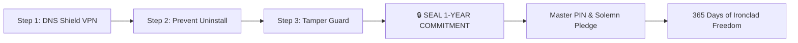

# 🛡️ DNSGuard PRO — The Uncompromising 1-Year Addiction Remover

<p align="center">
  
  
  
  
  
</p>

---

## ⚡ The Solemn Warning: Read Before Installing

> ### ⚠️ **TARGET: 1 YEAR OF UNCOMPROMISING FREEDOM**
> **DNSGuard PRO** is not a casual app with a quick toggle switch. It is engineered for individuals who are **100% serious** about breaking free from adult content and porn addiction permanently.
> 
> **IF YOU ARE NOT 100% SERIOUS, DO NOT DOWNLOAD OR ACTIVATE THIS APP.**
> 
> Once sealed with your Master Security PIN and solemn pledge:
> * ⛔ **NO WAY** to bypass, disable, or toggle off protection for **365 days (1 full year)**.
> * ⛔ **ALL** adult, pornographic, and relapse domains are blocked at the kernel network level.
> * ⛔ Device Administrator + Accessibility Guard block settings tampering and uninstall attempts.
> * ⛔ There is no secret back-door, no emergency unlock, and no soft exit until the countdown reaches zero.

---

## 🌟 Why DNSGuard PRO?

Most blocker apps fail because an urge strikes, and within 10 seconds the user opens Settings, toggles the switch off, uninstalls the app, and relapses.

**DNSGuard PRO solves the relapse problem completely.** By combining a local loopback DNS VPN, Android Device Administrator protection, real-time Accessibility watchdog defense, and hardware-backed cryptographic timer locks, it creates an impenetrable barrier that keeps you safe when willpower runs low.

### 📱 100% Standalone — Zero PC / Zero ADB Required
* **No computer or USB debugging needed:** Previous blockers required connecting your phone to a PC with command-line tools. **DNSGuard PRO is 100% standalone** and sets up in under 60 seconds directly from your phone.
* **Play Store Ready:** Fully compliant with all Google Play Store policies (VpnService, AccessibilityService prominent disclosure, and Device Administrator guidelines).
* **Dual Architecture:** Operates seamlessly in Standalone Mode on 100% of Android devices, with optional Device Owner privileged integration if available.

---

## 🚀 The 3-Step 60-Second Setup Wizard



1. **Step 1: Enable DNS Shield**
   * Establishes a local on-device VPN loopback that forwards all DNS queries to [KahfGuard](https://kahfguard.com) family resolvers (`203.190.10.118`, `185.228.168.10`, `185.228.169.11`).
   * 1-tap standard Android VPN permission dialog.
2. **Step 2: Prevent App Uninstall (Device Administrator)**
   * Registers DNSGuard PRO as an active Android Device Administrator.
   * Standard Android security policy prevents uninstalling the app from the launcher or app drawer.
3. **Step 3: Tamper Protection (Accessibility Guard)**
   * Activates the real-time window guard with Google Play prominent disclosure.
   * Instantly closes attempts to deactivate Device Administrator or change DNS settings.
4. **Final Action: Seal 1-Year Commitment**
   * Pulsing button unlocks once all 3 steps are active.
   * Create your 4–6 digit Master Security PIN, confirm the solemn pledge, and lock the device for 365 days.

---

## 🛡️ Multi-Layered Defense Matrix

| Defense Layer | Technology | Primary Role |
| :--- | :--- | :--- |
| **Layer 1: Network Shield** | `DnsVpnService` (Local Loopback) | Forces DNS to KahfGuard resolvers; blocks 10M+ adult and illicit domains on cellular and Wi-Fi. |
| **Layer 2: App Immutability** | `DeviceAdminReceiver` (Android DPM) | Blocks standard OS uninstallation attempts. |
| **Layer 3: Tamper Protection** | `GuardAccessibilityService` (100ms debounce) | Blocks settings tampering, clearing data, and deactivating admin rights. |
| **Layer 4: Real-Time Watchdog** | `LockMonitorService` (`ContentObserver`) | Foreground service monitoring DNS settings mutations in real-time. |
| **Layer 5: Re-Apply Daemon** | `AlarmManager` (Every 15 Minutes) | Wakes device and re-verifies all active security policies. |
| **Layer 6: Anti-Clock Tampering** | `NtpSyncWorker` (WorkManager) | Queries atomic network clocks (`pool.ntp.org`) every 6 hours to prevent manual date spoofing. |
| **Layer 7: Cryptographic Timer** | `EncryptedSharedPreferences` (AES-256) | Triple-redundant encrypted storage for high-water marks and countdown progress. |

---

## 🧠 Relapse Prevention & Mental Clarity Suite

DNSGuard PRO is more than a blocker; it is a mental fortitude operating system:

* **💨 SOS Calm & Breathe Banner:** Instant access to a guided 4-4-4-4 Box Breathing exercise (Inhale 4s, Hold 4s, Exhale 4s, Hold 4s) with haptic feedback to calm the nervous system during dopamine spikes.
* **📖 50-Story Daily Wisdom Vault:** Curated stoic and cognitive parables spanning *Self-Mastery, Urge Surfing, Dopamine Reset, Emotional Armor,* and *The Path of Resilience*.
* **🏆 Journey Milestones:** Unlock badges across your journey (Day 1: Seedling of Resolve, Day 3: Fire Starter, Day 7: Iron Week, Day 14: Neural Rewire, Day 30: Silver Month, Day 90: Golden Pillar, Day 180: Diamond Will, Day 365: Transcendent Freedom).
* **📡 Live DNS Shield Telemetry:** Real-time resolver diagnostic measuring network ping latency to `high.kahfguard.com` and verifying 100% protection status.
* **🌅 Morning Focus & 🌙 Nightly Directives:** Automated notifications delivering daily motivation and reflective prompts.

---

## 🔒 Google Play Policy & Privacy Compliance

* **Privacy Policy:** Read our full [Privacy Policy](PRIVACY_POLICY.md).
* **Zero Data Collection:** No personal information, passwords, keystrokes, or browsing history are ever recorded, collected, or uploaded.
* **Local Loopback Only:** The VPN service runs strictly on-device without remote commercial proxy servers.
* **Prominent Disclosure:** In accordance with Google Play Store guidelines, an explicit disclosure dialog is presented before enabling AccessibilityService.
* **No High-Risk Admin Flags:** Minimal Device Administrator footprint (`force-lock` only, zero wipe or camera interference).

---

## 🛠️ Building & Releasing

### Prerequisites
* JDK 17 (Java Development Kit)
* Android SDK (API 34 / Android 14)
* Android Studio Iguana / Jellyfish or Gradle 8.4+

### Compiling Debug APK
```bash
cd DnsGuard
./gradlew assembleDebug
```
Output location: `DnsGuard/app/build/outputs/apk/debug/app-debug.apk`

### Compiling Release Android App Bundle (AAB for Google Play)
```bash
./gradlew bundleRelease
```
Output location: `DnsGuard/app/build/outputs/bundle/release/app-release.aab`

---

## 📜 License

Licensed under the [Apache License, Version 2.0](LICENSE).  
Copyright (c) 2026 **zenbijoy**. All rights reserved.